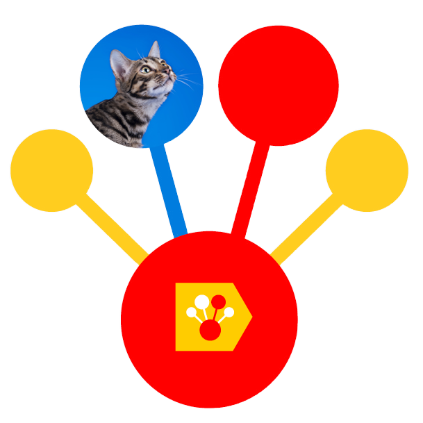

<a name="readme-top"></a>
<br />
<div align="center">
  <a href="#">
   <!-- Replace this logo for a custom official logo -->
    
  </a>

<h1 align = "center">
    <i><b>CatBoost</b> Laptop Prices</i>
</h1>
    <!-- Add/Remove categories depending on your project -->
  <p align="center">
    A CatBoost Regressor for Laptop Price Prediction!
    <br />
    <!-- IMPORTANT NOTE: If you want to append emojis you'll need to add the '-' sign before and after the header, as shown below:  -->
    <a href="#-requirements-">Requirements</a>
    ·
     <a href="#-technologies-">Technologies</a>
    ·
    <a href="#-license-">License</a>
  </p>
</div>

<!-- Here goes the project description -->
Here goes the project description.

## 📝 Requirements 📝

Here you can give instructions on how to set up your project locally: Installation, API keys, etc.

<p align="right">(<a href="#readme-top">back to top</a>)</p>

## 🦾 Technologies 🦾

This section should list any major frameworks/libraries used to bootstrap your project.

<p align="right">(<a href="#readme-top">back to top</a>)</p>

## 📜 License 📜

<!-- Change this license for the one used in your project -->

```
MIT License

Copyright (c) 2025 Jonathan Areas

Permission is hereby granted, free of charge, to any person obtaining a copy
of this software and associated documentation files (the "Software"), to deal
in the Software without restriction, including without limitation the rights
to use, copy, modify, merge, publish, distribute, sublicense, and/or sell
copies of the Software, and to permit persons to whom the Software is
furnished to do so, subject to the following conditions:

The above copyright notice and this permission notice shall be included in all
copies or substantial portions of the Software.

THE SOFTWARE IS PROVIDED "AS IS", WITHOUT WARRANTY OF ANY KIND, EXPRESS OR
IMPLIED, INCLUDING BUT NOT LIMITED TO THE WARRANTIES OF MERCHANTABILITY,
FITNESS FOR A PARTICULAR PURPOSE AND NONINFRINGEMENT. IN NO EVENT SHALL THE
AUTHORS OR COPYRIGHT HOLDERS BE LIABLE FOR ANY CLAIM, DAMAGES OR OTHER
LIABILITY, WHETHER IN AN ACTION OF CONTRACT, TORT OR OTHERWISE, ARISING FROM,
OUT OF OR IN CONNECTION WITH THE SOFTWARE OR THE USE OR OTHER DEALINGS IN THE
SOFTWARE.
```

<p align="right">(<a href="#readme-top">back to top</a>)</p>


<!-- This is a custom version of the Read-My-README template, by Jon Areas, 
found at: https://github.com/jxareas/read-my-readme -->

